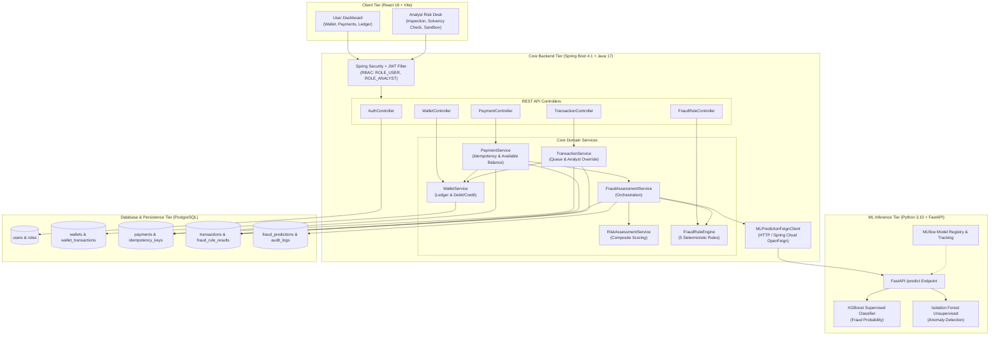

<div align="center">

# 🛡️ PayShield AI

### Real-Time Payment Fraud Detection Platform

[](https://openjdk.org/)
[](https://spring.io/projects/spring-boot)
[](https://python.org)
[](https://fastapi.tiangolo.com)
[](https://react.dev)
[](https://www.postgresql.org)
[](https://xgboost.readthedocs.io)
[](https://mlflow.org)
[](./LICENSE)

</div>

---

**PayShield AI** is a full-stack payment risk detection system that combines **deterministic fraud rules** with **machine learning inference** to make real-time ALLOW / REVIEW / BLOCK decisions on every payment. Payments that require human review are held in a queue for fraud analysts to inspect, approve, or reject through a dedicated analyst desk.

---

## Table of Contents

- [Architecture Overview](#architecture-overview)
- [Key Features](#key-features)
- [Repository Layout](#repository-layout)
- [Tech Stack](#tech-stack)
- [Quick Start](#quick-start)
  - [Prerequisites](#prerequisites)
  - [1. Database](#1-database-postgresql)
  - [2. Python ML Service](#2-python-ml-service)
  - [3. Spring Boot Backend](#3-spring-boot-backend)
  - [4. React Frontend](#4-react-frontend)
- [Environment Variables](#environment-variables)
- [User Roles](#user-roles)
- [Fraud Decision Logic](#fraud-decision-logic)
- [Documentation Index](#documentation-index)

---

## Architecture Overview



---

## Key Features

### For Users
- **Wallet System** — Balance, top-up, and full debit/credit ledger
- **Payments** — Create payments with idempotency-key safety; get real-time fraud decisions
- **Payment History** — Full list of all payments with status (APPROVED / REVIEW / REJECTED)

### For Fraud Analysts
- **Review Queue** — Paginated list of PENDING transactions flagged for review
- **Transaction Inspection** — Detailed view including wallet solvency check before approval
- **Approve / Reject** — PUT endpoint to COMPLETE (debit wallet) or BLOCK a payment
- **Fraud Rule Sandbox** — Evaluate the 5 fraud rules against any arbitrary payload

### Fraud Engine
- **5 Deterministic Rules** — Large Transaction, High Velocity, Unusual Amount, Account Anomaly, Destination Risk
- **XGBoost Classifier** — Trained on PaySim dataset; outputs fraud probability 0.0–1.0
- **Isolation Forest** — Unsupervised anomaly detector; outputs normalized anomaly score 0–100
- **Composite Scoring** — 60% XGBoost + 25% Rule Score + 15% Isolation Forest
- **Decision Matrix** — ALLOW (< 45) / REVIEW (45–74) / BLOCK (≥ 75 with ML confirmation)

---

## Repository Layout

```
PayShieldAI-Project/
├── backend/                        # Spring Boot 4.1 / Java 17 REST API
│   ├── src/main/java/com/payshield/
│   │   ├── controller/             # REST controllers (Auth, Payment, Transaction, Wallet, FraudRule)
│   │   ├── service/                # Business logic (Payment, Fraud, Risk, Wallet, Transaction)
│   │   ├── fraud/rule/             # 5 deterministic fraud rules + engine
│   │   ├── entity/                 # JPA entities + enums
│   │   ├── dto/                    # Request / response DTOs
│   │   ├── security/               # JWT filter, JwtService, UserDetailsService
│   │   ├── config/                 # SecurityConfig, FraudRuleConfig
│   │   ├── repository/             # Spring Data JPA repositories
│   │   ├── client/                 # Feign client to Python ML service
│   │   └── exception/              # GlobalExceptionHandler
│   ├── src/main/resources/
│   │   ├── application.properties
│   │   ├── application-dev.properties
│   │   └── db/                     # Flyway migrations
│   └── pom.xml
│
├── python-ml/                      # FastAPI ML Inference Service
│   ├── app/
│   │   ├── main.py                 # FastAPI app (GET /health, POST /predict)
│   │   ├── schemas.py              # Pydantic request/response schemas
│   │   ├── model_service.py        # Model loading, feature engineering, prediction
│   │   ├── config.py               # Model paths
│   │   ├── mlflow_config.py        # MLflow tracking URI
│   │   └── models/                 # XGBoost + Isolation Forest model wrappers
│   ├── scripts/                    # Training & evaluation scripts
│   │   ├── train_xgboost.py
│   │   ├── train_isolation_forest.py
│   │   ├── evaluate_models.py
│   │   ├── evaluate_isolation_forest.py
│   │   └── prepare_data.py
│   ├── data/                       # PaySim dataset (not committed)
│   ├── artifacts/                  # Saved model joblib bundles
│   ├── reports/                    # Evaluation reports
│   └── requirements.txt
│
├── frontend/                       # React 18 + Vite SPA
│   ├── src/
│   │   ├── App.jsx
│   │   ├── api/                    # Axios API calls
│   │   ├── components/             # Shared UI components
│   │   ├── context/                # Auth context
│   │   ├── views/                  # Page views (User, Analyst)
│   │   └── index.css
│   └── package.json
│
├── docs/                           # All documentation
│   ├── api/                        # API reference (7 files)
│   ├── diagrams/                   # Mermaid architecture diagrams
│   ├── ml/                         # ML architecture docs
│   └── architecture/               # Backend architecture docs
│
├── infrastructure/
│   └── aws/                        # AWS infrastructure config
│
├── .env.example                    # Environment variable template
└── LICENSE
```

---

## Tech Stack

| Layer | Technology |
|---|---|
| **Backend** | Spring Boot 4.1, Java 17, Spring Security, Spring Data JPA |
| **Auth** | JWT (JJWT 0.12.6), BCrypt, Role-Based Access Control |
| **ML Service** | Python 3.10+, FastAPI, XGBoost, scikit-learn, MLflow |
| **ML Models** | XGBoost (supervised), Isolation Forest (unsupervised) |
| **ML Tracking** | MLflow (experiment tracking, model registry) |
| **Frontend** | React 18, Vite, Axios |
| **Database** | PostgreSQL 15+, Flyway migrations |
| **HTTP Client** | Spring Cloud OpenFeign (backend → ML service) |
| **Build** | Maven (backend), pip (python-ml), npm (frontend) |

---

## Quick Start

### Prerequisites

- Java 17+
- Maven 3.9+
- Python 3.10+
- Node.js 18+
- PostgreSQL 15+

---

### 1. Database (PostgreSQL)

```bash
psql -U postgres
CREATE DATABASE payshield;
```

Flyway migrations run automatically on backend startup.

---

### 2. Python ML Service

```bash
cd python-ml

# Create and activate virtual environment
python -m venv .venv
.venv\Scripts\activate          # Windows
source .venv/bin/activate        # macOS/Linux

# Install dependencies
pip install fastapi uvicorn pydantic numpy pandas scikit-learn xgboost joblib matplotlib seaborn mlflow

# Train models (requires PaySim dataset in data/)
python -m scripts.prepare_data
python -m scripts.train_xgboost
python -m scripts.train_isolation_forest

# Start ML service (port 8000)
uvicorn app.main:app --reload --port 8000
```

---

### 3. Spring Boot Backend

Copy `.env.example` to `.env` and fill in your values, then:

```bash
cd backend
./mvnw spring-boot:run
```

Backend starts on **port 8080**.

---

### 4. React Frontend

```bash
cd frontend
npm install
npm run dev
```

Frontend starts on **port 5173**.

---

## Environment Variables

Copy `.env.example` to `.env` in the project root:

```env
# Database
DB_URL=jdbc:postgresql://localhost:5432/payshield
DB_USERNAME=postgres
DB_PASSWORD=your_password

# JWT
JWT_SECRET=your-256-bit-secret-key
JWT_EXPIRATION=86400000

# Python ML Service
ML_SERVICE_URL=http://localhost:8000
```

---

## User Roles

| Role | Description | Access |
|---|---|---|
| `ROLE_USER` | Regular user | Wallet, payments, own transaction history |
| `ROLE_ANALYST` | Fraud analyst | Review queue, approve/reject payments, fraud rule sandbox |

---

## Fraud Decision Logic

Every payment triggers a full fraud assessment pipeline:

```
Composite Risk Score = (XGBoost_Prob × 100 × 0.60)
                     + (Rule_Score × 0.25)
                     + (Isolation_Score × 0.15)

If any HIGH-severity rule fired → floor score at 55

Decision:
  score  < 45          → ALLOW  (debit wallet immediately)
  45 ≤ score < 75      → REVIEW (hold funds, queue for analyst)
  score ≥ 75
    AND (XGBoost=1 OR Anomaly=true) → BLOCK  (reject payment)
    AND both ML clean               → REVIEW (downgrade to review)
```

---

## Documentation Index

| Doc | Description |
|---|---|
| [docs/README.md](./docs/README.md) | Master documentation index |
| [docs/api/AUTHENTICATION_API.md](./docs/api/AUTHENTICATION_API.md) | Auth (register, login) |
| [docs/api/PAYMENT_API.md](./docs/api/PAYMENT_API.md) | Payment creation & lookup |
| [docs/api/TRANSACTION_API.md](./docs/api/TRANSACTION_API.md) | Transaction queue & analyst override |
| [docs/api/WALLET_API.md](./docs/api/WALLET_API.md) | Wallet balance & ledger |
| [docs/api/FRAUD_RULE_API.md](./docs/api/FRAUD_RULE_API.md) | Fraud rule sandbox (ANALYST only) |
| [docs/api/ML_API.md](./docs/api/ML_API.md) | Python ML inference service |
| [docs/api/ANALYTICS_API.md](./docs/api/ANALYTICS_API.md) | Analytics endpoints |
| [docs/diagrams/system-architecture.md](./docs/diagrams/system-architecture.md) | End-to-end system diagram |
| [docs/diagrams/payment-lifecycle.md](./docs/diagrams/payment-lifecycle.md) | Payment sequence diagram |
| [docs/diagrams/fraud-rule-engine.md](./docs/diagrams/fraud-rule-engine.md) | Fraud engine flowchart |
| [docs/diagrams/database-erd.md](./docs/diagrams/database-erd.md) | Database ERD |
| [docs/diagrams/analyst-approval-flow.md](./docs/diagrams/analyst-approval-flow.md) | Analyst review flow |
| [docs/diagrams/authentication-sequence.md](./docs/diagrams/authentication-sequence.md) | JWT auth flow |
| [docs/ml/ML_ARCHITECTURE.MD](./docs/ml/ML_ARCHITECTURE.MD) | ML model architecture |
| [docs/ml/PAYSIM_PIPELINE.md](./docs/ml/PAYSIM_PIPELINE.md) | PaySim data pipeline |
| [docs/ml/MLFLOW.md](./docs/ml/MLFLOW.md) | MLflow tracking setup |
| [backend/README.md](./backend/README.md) | Backend service guide |
| [python-ml/README.md](./python-ml/README.md) | ML service guide |

---

## License

[MIT](./LICENSE) © PayShield AI
