# PayShield AI — Backend Layered Architecture

The Spring Boot backend follows a strict **layered architecture** where each layer has a single responsibility and dependencies only flow downward.

---

## Layer Diagram

```mermaid
flowchart TD
    Client["React Frontend / External API Client"]
    
    subgraph Security_Layer ["Security Layer"]
        JWT["JwtAuthenticationFilter"]
        SC["SecurityConfig (RBAC)"]
    end

    subgraph Controller_Layer ["Controller Layer (REST)"]
        AC["AuthController"]
        PC["PaymentController"]
        WC["WalletController"]
        TC["TransactionController"]
        FC["FraudRuleController"]
        HC["HealthController"]
    end

    subgraph Service_Layer ["Service Layer (Business Logic)"]
        AS["AuthService"]
        PS["PaymentService"]
        FAS["FraudAssessmentService"]
        RAS["RiskAssessmentService"]
        WS["WalletService"]
        TS["TransactionService"]
        HS["HealthService"]
    end

    subgraph Fraud_Engine ["Fraud Rule Engine"]
        FRE["FraudRuleEngine"]
        R1["LargeTransactionRule"]
        R2["HighVelocityRule"]
        R3["UnusualAmountRule"]
        R4["AccountActivityAnomalyRule"]
        R5["DestinationRiskRule"]
    end

    subgraph ML_Client ["ML Client Layer"]
        Feign["MLPredictionFeignClient (OpenFeign)"]
        Li["LoggingInterceptor"]
    end

    subgraph Repository_Layer ["Repository Layer (Spring Data JPA)"]
        UR["UserRepository"]
        WR["WalletRepository"]
        PR["PaymentRepository"]
        TR["TransactionRepository"]
        FR["FraudPredictionRepository"]
        FRR["FraudRuleResultRepository"]
        IKR["IdempotencyKeyRepository"]
        WTR["WalletTransactionRepository"]
    end

    DB[("PostgreSQL Database")]
    ML[("Python FastAPI ML Service")]

    Client --> Security_Layer
    Security_Layer --> Controller_Layer
    AC --> AS
    PC --> PS
    WC --> WS
    TC --> TS
    FC --> FRE
    PS --> FAS
    PS --> WS
    FAS --> FRE
    FAS --> Feign
    FAS --> RAS
    TS --> WS
    FRE --> R1 & R2 & R3 & R4 & R5
    Feign --> Li
    Feign --> ML
    AS --> UR
    PS --> PR & TR & WR & IKR
    FAS --> FR & FRR & TR
    WS --> WR & WTR
    TS --> TR & PR
    UR & WR & PR & TR & FR & FRR & IKR & WTR --> DB
```



---

## Layer Responsibilities

### Security Layer

| Class | Responsibility |
|---|---|
| `JwtAuthenticationFilter` | Intercepts every request, extracts JWT, validates it, sets `SecurityContext` |
| `SecurityConfig` | Defines route access rules, session policy (stateless), auth provider |
| `JwtService` | Token generation, username extraction, expiry validation (JJWT 0.12.6) |
| `CustomUserDetailsService` | Loads `UserDetails` from DB by email for Spring Security |

### Controller Layer

Controllers handle **only** HTTP concerns: request parsing, response mapping, and HTTP status codes. No business logic lives here.

| Controller | Endpoint Group |
|---|---|
| `AuthController` | `/api/v1/auth` |
| `PaymentController` | `/api/v1/payments` |
| `WalletController` | `/api/v1/wallet` |
| `TransactionController` | `/api/v1/transactions` |
| `FraudRuleController` | `/api/v1/fraud/rules` |
| `HealthController` | `/actuator/health` |

### Service Layer

All business logic, transaction management (`@Transactional`), and orchestration live here.

| Service | Key Responsibilities |
|---|---|
| `AuthService` | Register user + wallet, login, JWT generation |
| `PaymentService` | Idempotency check, available balance check, fraud orchestration, conditional wallet debit |
| `FraudAssessmentService` | Rule evaluation, ML call, composite scoring, persistence of fraud results |
| `RiskAssessmentService` | Weighted composite score formula, risk level mapping, decision matrix |
| `WalletService` | Debit, credit, top-up, double-entry ledger entry, optimistic lock |
| `TransactionService` | Review queue, analyst override, overdraft prevention on approval |

### Fraud Rule Engine

The `FraudRuleEngine` is a Spring-managed service that holds a `List<FraudRule>` injected by Spring. It iterates all 5 rules and sums triggered risk points. Each rule implements the `FraudRule` interface.

```java
// FraudRule interface
FraudRuleEvaluation evaluate(FraudRuleContext context);
```

### ML Client Layer

`MLPredictionFeignClient` is a Spring Cloud OpenFeign declarative HTTP client. It calls `POST /predict` on the Python FastAPI service and maps the JSON response to `FraudPredictionResponse`. `LoggingInterceptor` logs the outbound request for debugging.

### Repository Layer

10 Spring Data JPA repositories. Custom query methods include:
- `PaymentRepository.sumPendingReviewAmountByUserId()` — sum of REVIEW payment amounts per user
- `TransactionRepository.countByUserIdSince()` — velocity counts for fraud rules
- `TransactionRepository.countRecentFailedAttempts()` — failed attempt count for anomaly rule
- `TransactionRepository.findAverageAmountByUserId()` — user's average transaction amount for unusual amount rule