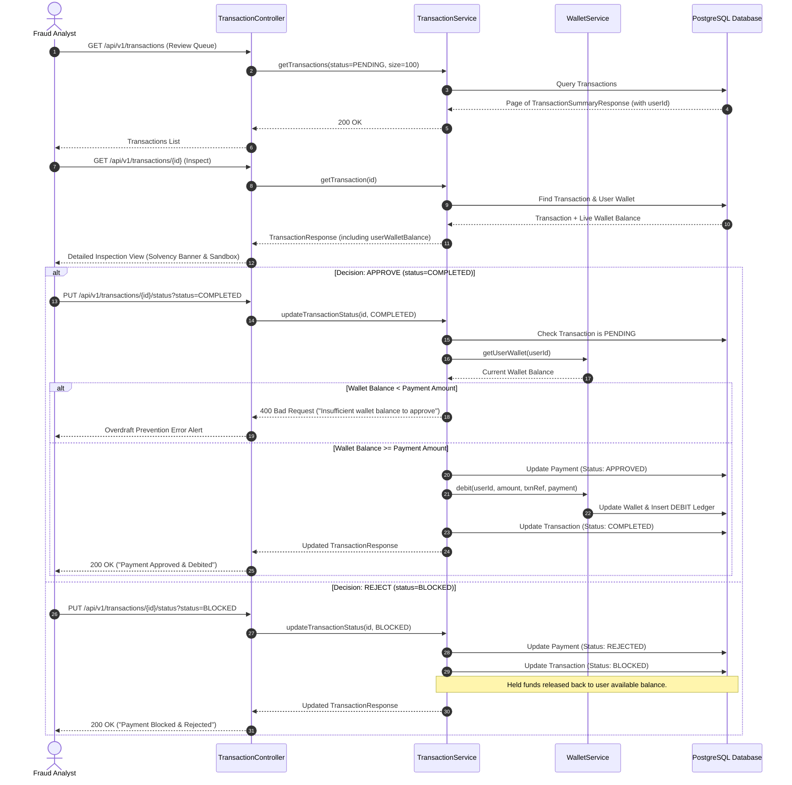

# PayShield AI — Analyst Review & Decision Flow

This sequence diagram documents how a fraud analyst interacts with the review queue — from loading the list of pending transactions through inspecting an individual transaction (with live wallet solvency check) to making an approve or reject decision.

---

## Analyst Workflow Overview

1. **Load Review Queue** — `GET /api/v1/transactions?status=PENDING` — paginated list of all transactions waiting for human review
2. **Inspect Transaction** — `GET /api/v1/transactions/{id}` — full details including the user's **live wallet balance** (solvency banner)
3. **Make Decision**:
   - **Approve** → `PUT /api/v1/transactions/{id}/status?status=COMPLETED` — debit wallet + release held funds
   - **Reject** → `PUT /api/v1/transactions/{id}/status?status=BLOCKED` — cancel payment + release held funds

---

## Sequence Diagram



---

## Solvency Check — Overdraft Prevention

When an analyst approves a transaction, `TransactionService` checks the user's **current** wallet balance before calling `WalletService.debit()`. This prevents a scenario where:

- User had ₹100,000 in their wallet at the time of payment
- Multiple payments went to `REVIEW`
- By the time the analyst approves, the wallet balance has dropped below the payment amount

If `walletBalance < paymentAmount`, the approval is rejected with a `400 Bad Request` and a clear error message:

```json
{
  "success": false,
  "message": "Insufficient wallet balance to approve this transaction. Current balance: ₹20,000.00, Required: ₹75,000.00",
  "data": null
}
```

---

## Held Funds Mechanics

When a payment is in `REVIEW` status, the funds are **not physically held** — the wallet balance is unchanged. Instead, `PaymentService` queries `sumPendingReviewAmountByUserId()` before each new payment to calculate:

```
Available Balance = Wallet Balance − Sum of REVIEW payment amounts
```

When an analyst **rejects** (BLOCKED), the REVIEW payment is removed from this sum, so the funds become available again automatically — no explicit release is needed.
