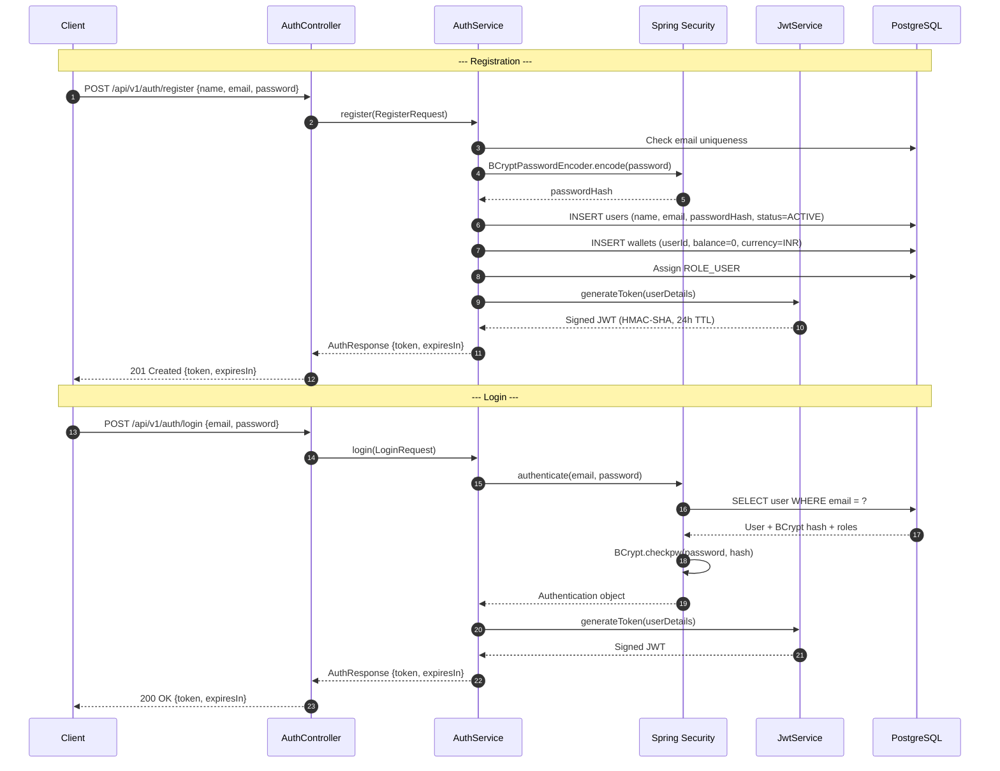
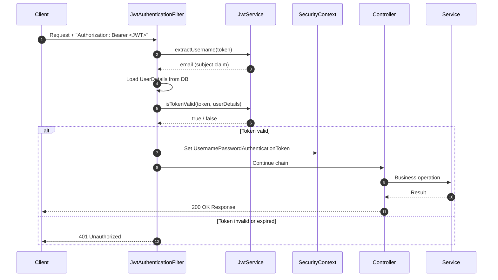

# PayShield AI — JWT Authentication Sequence

This diagram covers both the **registration** and **login** flows that produce a JWT, and how that token is used on subsequent requests.

---

## Registration Flow

When a new user registers, the backend:
1. Validates the request
2. Hashes the password with BCrypt (cost factor 12)
3. Creates the `users` record and a linked `wallets` record (zero balance)
4. Assigns `ROLE_USER` by default
5. Generates and returns a JWT immediately — no separate login step required

---

## Authentication Sequence Diagram

---

## JWT Structure

The JWT is signed with **HMAC-SHA** using a secret key from `application.properties`.

**Claims:**
- `sub` — user email (used as username throughout the system)
- `iat` — issued-at timestamp
- `exp` — expiry timestamp (default: 24 hours after issuance)

---

## Authenticated Request Flow

---

## Token Expiry & Security Notes

| Property | Value |
|---|---|
| Algorithm | HMAC-SHA (key-length dependent) |
| Default TTL | 24 hours (configurable via `jwt.expiration`) |
| Subject claim | User email |
| Session type | **Stateless** — no server-side session |
| Password hashing | BCrypt, cost factor 12 |

There is no token refresh endpoint — users must re-login after expiry.