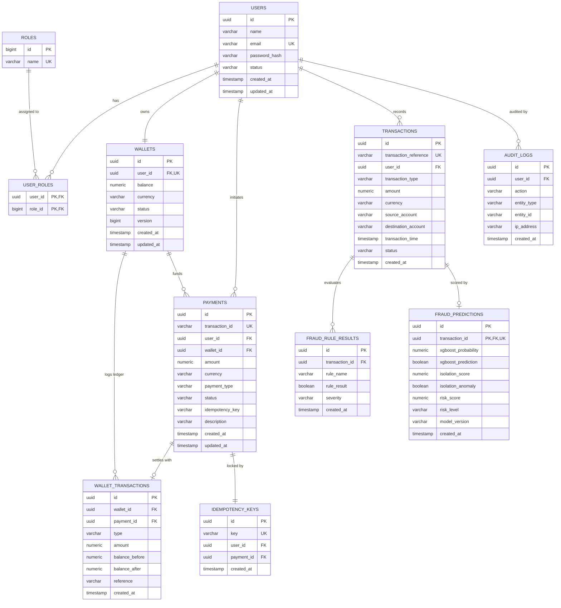

# PayShield AI — Complete Entity Relationship Diagram (ERD)

This ERD covers all **10 tables** in the PayShield AI PostgreSQL database. Tables are managed by Flyway migrations that run automatically on backend startup.

---

## Entity Relationship Diagram

---

## Table Descriptions

### `users`
Core identity table. Each user has a UUID primary key, unique email, bcrypt-hashed password, and status flag.

| Column | Notes |
|---|---|
| `id` | UUID, generated by DB |
| `email` | Unique — used as username in JWT subject |
| `password_hash` | BCrypt (cost factor 12) |
| `status` | `ACTIVE` or `INACTIVE` |

---

### `roles` + `user_roles`
Role-based access control. Roles: `ROLE_USER`, `ROLE_ANALYST`. A user can have multiple roles.

---

### `wallets`
One wallet per user (1:1 relationship). Uses **optimistic locking** (`version` column) to prevent concurrent debit race conditions.

| Column | Notes |
|---|---|
| `balance` | `numeric(19,4)` precision |
| `currency` | Default `INR` |
| `version` | Optimistic lock version for `@Version` |

---

### `wallet_transactions`
Double-entry ledger. Every debit or credit to a wallet creates one row here with `balance_before` and `balance_after` for auditability.

| Column | Notes |
|---|---|
| `type` | `DEBIT` or `CREDIT` |
| `payment_id` | Linked payment (null for top-ups) |
| `reference` | Transaction reference or `TOPUP` |

---

### `payments`
One payment record per payment request. Status lifecycle: `REVIEW` → `APPROVED` or `REJECTED`.

| Column | Notes |
|---|---|
| `transaction_id` | References the matching `transactions.transaction_reference` |
| `idempotency_key` | Client-supplied key for deduplication |
| `status` | `APPROVED`, `REVIEW`, or `REJECTED` |

---

### `idempotency_keys`
Locks a payment to an idempotency key. If a key already exists for a user, the existing payment is returned instead of creating a new one.

---

### `transactions`
Low-level financial transaction record created before fraud assessment. Status: `PENDING` → `COMPLETED` or `BLOCKED`.

| Column | Notes |
|---|---|
| `transaction_reference` | Format: `TXN-<16 hex chars>` |
| `status` | `PENDING`, `COMPLETED`, `BLOCKED` |

---

### `fraud_rule_results`
One row per rule per transaction. Stores which rules fired and their severity classification.

| Column | Notes |
|---|---|
| `rule_name` | Enum name of the fraud rule |
| `rule_result` | `true` if rule triggered |
| `severity` | `HIGH` if triggered, `LOW` otherwise |

---

### `fraud_predictions`
ML model output stored per transaction. Includes both XGBoost and Isolation Forest results plus the composite score.

| Column | Notes |
|---|---|
| `xgboost_probability` | Raw probability [0.0–1.0] |
| `xgboost_prediction` | Boolean: fraud or not |
| `isolation_score` | Normalized [0–100] |
| `isolation_anomaly` | Boolean |
| `risk_score` | Composite score [0–100] |
| `risk_level` | `LOW`, `MEDIUM`, or `HIGH` |
| `model_version` | Identifies model artifact version |

---

### `audit_logs`
Records significant user actions for compliance and traceability.