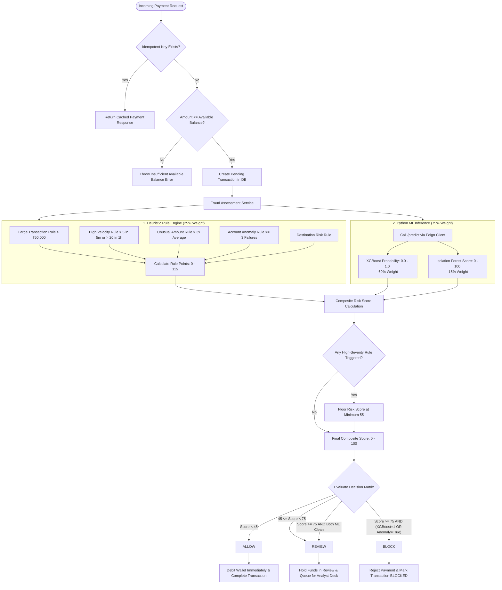

# PayShield AI — Hybrid Fraud Engine Decision Pipeline

This flowchart documents the complete fraud detection pipeline that runs inside `FraudAssessmentService` on every payment. It combines deterministic heuristic rules with two machine learning models to produce a single composite risk score and actionable decision.

---

## Scoring Weights

| Signal | Weight | Range |
|---|---|---|
| XGBoost probability | **60%** | 0.0 – 1.0 (converted to 0–100) |
| Rule engine score | **25%** | 0 – 115 points (capped at 100 for weighting) |
| Isolation Forest score | **15%** | 0 – 100 (normalized) |

---

## Decision Matrix

| Composite Score | XGBoost / Anomaly Condition | Decision |
|---|---|---|
| `< 45` | — | **ALLOW** |
| `45 – 74` | — | **REVIEW** |
| `≥ 75` | XGBoost=1 OR Anomaly=true | **BLOCK** |
| `≥ 75` | Both ML signals are clean | **REVIEW** (downgrade to prevent false positives) |

The double-confirmation requirement for `BLOCK` means a high composite score alone is not enough — at least one ML model must independently agree.

---

## Decision Flowchart



---

## The 5 Fraud Rules

All 5 rules run for every transaction. Each produces a boolean `triggered` flag and a `riskPoints` value.

| Rule Class | Trigger | Risk Points |
|---|---|---|
| `LargeTransactionRule` | `amount > ₹50,000` | 30 |
| `HighVelocityRule` | `> 5 txn in last 5 min` OR `> 20 txn in last 1 hr` | 35 |
| `UnusualAmountRule` | `amount > 3 × user's average transaction amount` | 20 |
| `AccountActivityAnomalyRule` | `≥ 3 failed transaction attempts in last 24 hr` | 20 |
| `DestinationRiskRule` | Destination is flagged as high-risk | 10 |

**Maximum rule score: 115 points.**

The rule engine is implemented in `FraudRuleEngine.java`, which iterates over all 5 registered `FraudRule` beans and sums the risk points from triggered rules.

---

## High-Severity Rule Override

If any rule that fires is classified as HIGH severity, the composite score is floored at **55**. This means even a transaction with low ML scores will always go to `REVIEW` if a rule fires — it can never be silently `ALLOW`'d.

```java
if (anyHighSeverityRuleTriggered) {
    score = Math.max(score, HIGH_SEVERITY_RULE_FLOOR); // 55.0
}
```

---

## Persistence

After assessment, the following are saved to the database:

- **`fraud_rule_results`** — one row per rule per transaction (triggered/not, severity)
- **`fraud_predictions`** — XGBoost probability, prediction, IF score, IF anomaly, composite score, risk level, model version