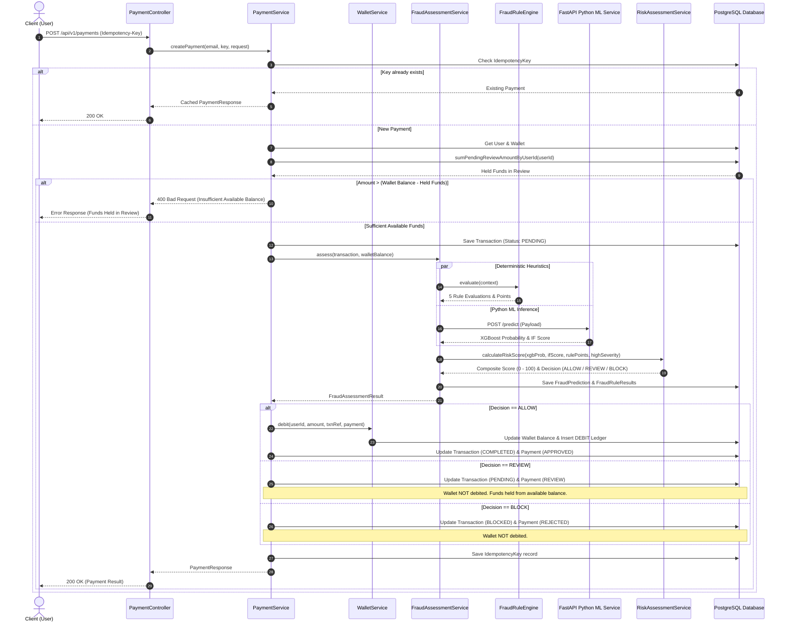

# PayShield AI — Payment Processing & Fraud Assessment Sequence

This sequence diagram traces the full lifecycle of a payment from the moment a user submits `POST /api/v1/payments` through fraud assessment and the final wallet debit (or hold).

---

## Key Design Decisions

1. **Idempotency first** — if an `Idempotency-Key` has already been used, the cached `PaymentResponse` is returned immediately. No duplicate processing.
2. **Available balance check** — the system deducts funds held in `REVIEW` status from the total wallet balance before checking affordability. This prevents overdraft from held funds.
3. **Wallet is debited ONLY on ALLOW** — for `REVIEW` and `BLOCK` decisions, the wallet balance is never reduced. `REVIEW` funds are simply excluded from the "available" calculation.
4. **Parallel fraud signals** — the rule engine and ML service conceptually run as two independent signals that are then combined by `RiskAssessmentService`.

---

## Sequence Diagram



---

## Payment Status Outcomes

| Fraud Decision | Payment Status | Transaction Status | Wallet Effect |
|---|---|---|---|
| `ALLOW` | `APPROVED` | `COMPLETED` | Debited immediately |
| `REVIEW` | `REVIEW` | `PENDING` | Funds held (not debited); queued for analyst |
| `BLOCK` | `REJECTED` | `BLOCKED` | Not debited |

---

## Composite Risk Score Formula

```
Score = (XGBoost_Prob × 100 × 0.60)
      + (Rule_Points × 0.25)
      + (Isolation_Score × 0.15)

If any HIGH-severity rule fired:
  Score = max(Score, 55)

Decision:
  Score < 45           → ALLOW
  45 ≤ Score < 75      → REVIEW
  Score ≥ 75
    AND (XGBoost=1 OR Anomaly=true) → BLOCK
    AND both ML clean               → REVIEW (downgrade)
```

See [fraud-rule-engine.md](./fraud-rule-engine.md) for the complete flowchart.
