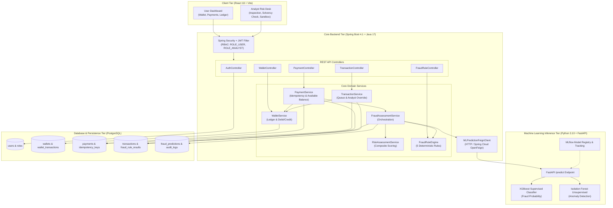

# PayShield AI — End-to-End System Architecture

This diagram shows the full tier-by-tier architecture of the PayShield AI platform: how the React frontend communicates with the Spring Boot backend, how the backend delegates ML inference to the Python FastAPI service, and how all data is persisted in PostgreSQL.

---

## Architecture Diagram

---

## Tier Descriptions

### Client Tier — React 18 + Vite

Two distinct UIs are served from the same React SPA:

- **User Dashboard** — Wallet balance, payment creation, payment history, debit/credit ledger
- **Analyst Risk Desk** — Paginated review queue, transaction inspection with live solvency banner, approve/reject controls, fraud rule sandbox

All API calls include a `Bearer <JWT>` header. The React frontend reads the user's role from the decoded token to conditionally render the correct view.

---

### Core Backend Tier — Spring Boot 4.1 + Java 17

**Security layer** (`JwtAuthenticationFilter` + `SecurityConfig`):
- Extracts and validates JWT from every request
- Enforces RBAC: `ROLE_USER` for payments/wallet, `ROLE_ANALYST` for fraud rules and analytics
- Stateless — no server-side session

**Controllers** map HTTP verbs to service calls. There are 5 REST controllers:
- `AuthController` — register + login
- `PaymentController` — create + get payments
- `WalletController` — balance + ledger + top-up
- `TransactionController` — review queue + analyst status update
- `FraudRuleController` — analyst sandbox for rule evaluation

**Business Services** contain all domain logic. Key orchestration:
- `PaymentService` — idempotency check → balance check → fraud assessment → conditional wallet debit
- `FraudAssessmentService` — runs rule engine + calls ML service + calculates composite score
- `RiskAssessmentService` — applies weighted formula (60/25/15) and decision matrix
- `WalletService` — transactional debit/credit with optimistic locking (version field)
- `TransactionService` — analyst review queue with overdraft prevention on approval

**ML Client** (`MLPredictionFeignClient`) — Spring Cloud OpenFeign HTTP client. Calls `POST http://localhost:8000/predict` and maps the JSON response to `FraudPredictionResponse`.

---

### ML Inference Tier — Python 3.10 + FastAPI

Two models run in sequence for every `/predict` call:

1. **XGBoost** — supervised binary classifier trained on PaySim dataset. Outputs fraud probability `[0.0, 1.0]`.
2. **Isolation Forest** — unsupervised anomaly detector. Outputs a normalized anomaly score `[0, 100]`.

Both models were trained offline using scripts in `python-ml/scripts/` and saved as joblib bundles. MLflow tracked all experiments.

---

### Database & Persistence Tier — PostgreSQL

**10 tables** managed by Flyway migrations:

| Table Group | Tables |
|---|---|
| Identity | `users`, `roles`, `user_roles` |
| Wallet | `wallets`, `wallet_transactions` |
| Payments | `payments`, `idempotency_keys` |
| Fraud | `transactions`, `fraud_rule_results`, `fraud_predictions` |
| Audit | `audit_logs` |

See [database-erd.md](./database-erd.md) for the full ERD.