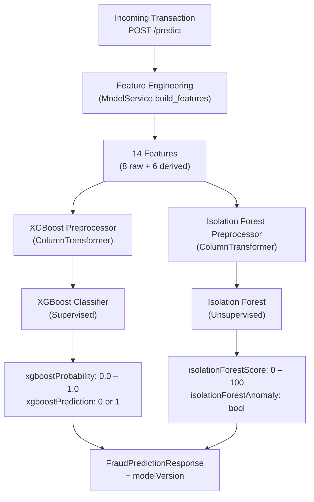

# PayShield AI — ML Model Architecture

The Python ML service (`python-ml/`) implements a **dual-model fraud detection architecture** using two complementary approaches: supervised classification with XGBoost and unsupervised anomaly detection with Isolation Forest. Both models are trained on the **PaySim** synthetic financial transaction dataset.

---

## Architecture Overview



---

## Model 1: XGBoost Classifier

### Purpose
Supervised binary classification — trained with labeled data from PaySim to distinguish fraudulent from legitimate transactions.

### Training
- Trained in `scripts/train_xgboost.py`
- Uses a preprocessor pipeline (one-hot encoding for categorical `type`, scaling for numerics)
- Saved as a joblib bundle: `{"preprocessor": ..., "model": ...}`

### Inference
```python
xgb_features = xgb_preprocessor.transform(features)
xgb_probability = xgb_model.predict_proba(xgb_features)[0][1]
xgb_prediction = int(xgb_probability >= 0.5)
```

### Output
| Field | Range | Description |
|---|---|---|
| `xgboostProbability` | `[0.0, 1.0]` | Probability that the transaction is fraudulent |
| `xgboostPrediction` | `0` or `1` | Binary label: 1 = fraud |

### Weight in composite score: **60%**

---

## Model 2: Isolation Forest

### Purpose
Unsupervised anomaly detection — does not require fraud labels. Identifies transactions that are statistically unusual compared to the training distribution.

### Training
- Trained in `scripts/train_isolation_forest.py`
- Same preprocessor pipeline structure
- Saved as a joblib bundle: `{"preprocessor": ..., "model": ...}`

### Inference
```python
isolation_features = isolation_preprocessor.transform(features)
raw_score = isolation_model.decision_function(isolation_features)[0]
isolation_prediction = isolation_model.predict(isolation_features)[0]
isolation_anomaly = (isolation_prediction == -1)
```

### Score Normalization
The raw `decision_function` output is converted to a 0–100 risk scale:

```python
# Positive raw score → normal → low risk score
# Negative raw score → anomaly → high risk score
normalized_score = 50 - (raw_score * 50)
normalized_score = max(0.0, min(100.0, normalized_score))
```

### Output
| Field | Range | Description |
|---|---|---|
| `isolationForestScore` | `[0, 100]` | Anomaly score (higher = more suspicious) |
| `isolationForestAnomaly` | `bool` | `true` if classified as anomaly (prediction = -1) |

### Weight in composite score: **15%**

---

## Feature Engineering

`ModelService.build_features()` computes 6 derived features from 8 raw PaySim fields:

| Feature | Source | Description |
|---|---|---|
| `step` | Raw | PaySim simulation hour step |
| `type` | Raw | Transaction type (PAYMENT, TRANSFER, etc.) |
| `amount` | Raw | Transaction amount |
| `oldbalanceOrg` | Raw | Sender balance before |
| `newbalanceOrig` | Raw | Sender balance after |
| `oldbalanceDest` | Raw | Receiver balance before |
| `newbalanceDest` | Raw | Receiver balance after |
| `isFlaggedFraud` | Raw | System pre-flag (0/1) |
| `hour` | Derived | `step % 24` — time of day |
| `day` | Derived | `step // 24` — simulation day |
| `origin_balance_error` | Derived | `oldbalanceOrg − amount − newbalanceOrig` — balance reconciliation error |
| `destination_balance_error` | Derived | `oldbalanceDest + amount − newbalanceDest` — destination reconciliation |
| `amount_to_origin_balance` | Derived | `amount / (oldbalanceOrg + 1)` — proportion of sender balance |
| `amount_to_destination_balance` | Derived | `amount / (oldbalanceDest + 1)` — proportion of receiver balance |

The balance error features are particularly informative for fraud detection, as fraudulent transactions often show discrepancies between expected and actual balances.

---

## Model Loading

On FastAPI startup:

```python
@app.on_event("startup")
def startup_event():
    model_status = model_service.load_models()
    # Loads:
    # - artifacts/xgboost_bundle.pkl  → {"preprocessor": ..., "model": ...}
    # - artifacts/isolation_forest_bundle.pkl → {"preprocessor": ..., "model": ...}
```

Both bundles are loaded from paths configured in `app/config.py`.

---

## Model Versioning

The response includes a `modelVersion` string that identifies which model files are loaded:

```json
{
  "modelVersion": "xgboost-v1-isolation-v1"
}
```

This version string is also persisted to the `fraud_predictions` table in PostgreSQL for auditability.